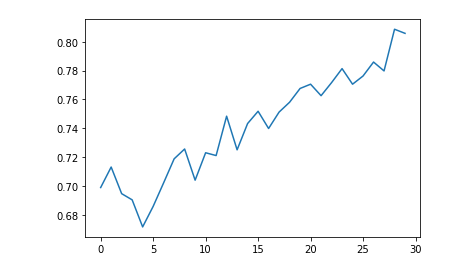
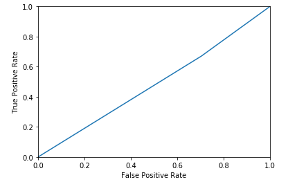

# CleanCarChecker(CCC)
by Tom Hacker, Verena Teufl

Image Classification of "normal" cars and e-cars.
The neural network in use contains 5 convolution layers, 2 pooling layer. 
Between these and the 2 fully connected layers (1 normal, 1 softmax) is a flatten layer.

The network achieves pretty good results (up to 75% testing accuracy, here with 30 epochs). 

  

But the confusion matrix, the ROC curve and the AUC yield bad results (here AUC under 0.49).
We tried around a lot with different network configurations and different batch sizes but couldn't get better results. 

  

Nevertheless the current state of the jupyter notebook shows one of the best restults  (AUC > 0.5).

Problems:
Initially we had the network badly configured: We didn't use pooling layers to reduse the amount of data. This lead to a very high number of parameters in the dense layers of the network.
Another problem we had was an annoyingly high number of broken images. Every training run was mostly filled with warnings that some images couldn't be opened. This can still be seen in the notebook.
As the warnings had no mention of the image name we couldn't remove the images. Even some extensive googling didn't lead us to a solution for this problem. Since we don't think it had an impact on the training we gave up on trying to find a solution.
Further we think our task, doing a classification of "normal" cars and e-cars only by consindering the front view of the car is a little bit too ambitious since there are mostly only very little distinctive features between those two.

For more documentation, the code and results see the jupyter notebook (see CleanCarChecker/CleanCarChecker.jpynp).

